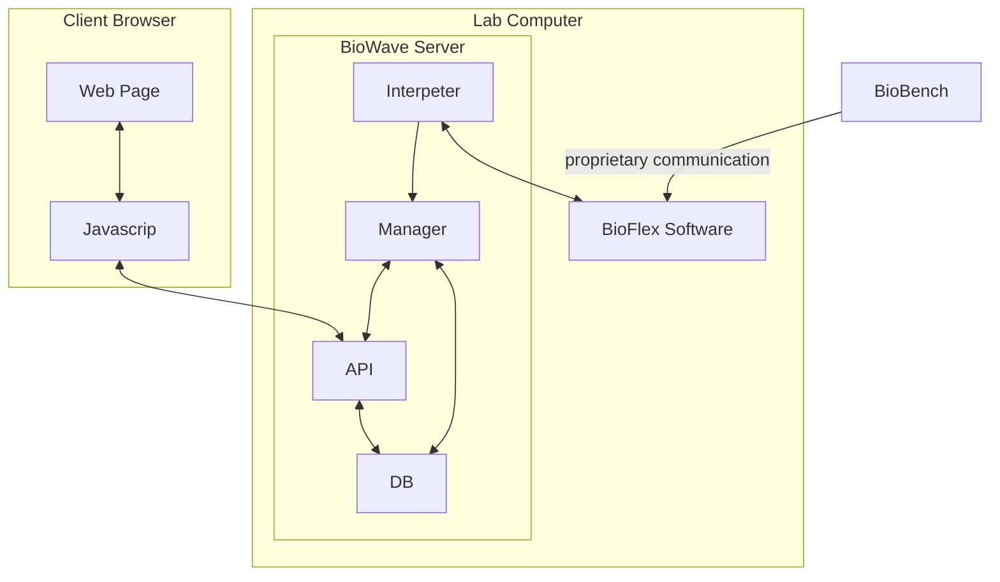

# BioWave

## Overview  

BioWave is a web-based application designed to remotely control and monitor the **BioBench bioreactor** (BioFlex) over a **Local Area Network (LAN)**. Unlike the existing Windows-only software, BioWave provides a **cross-platform, mobile-friendly interface**, making it more accessible for chemists and students who may not be tech-savvy.

## Design prototype (PenPot)
- [Home Page](https://design.penpot.app/#/view?file-id=9f31952d-2d54-8169-8006-1327b5e0986d&page-id=9f31952d-2d54-8169-8006-13082bd4948d&section=interactions&index=0&share-id=749aaa04-8836-81c6-8006-13bc233b8c5f)

## General Objectives

* [ ] Make a dynamic web app that can remotely connect to the bio reactor BioBench like the BioFlex Windows Software.
* [ ] It works on the same LAN (Local Area Network), allowing the user to insert operations with or without time stamps, visualize data and generally control it.
* [ ] The app should be user friendly both from desktop and mobile as the majority of the chemists students don't are generally skilled with computers.

***

## Wiki

### Tech Stack

#### Frontend

* **Styling**: TailwindCSS / Bootstrap
* **Visualization**: Chart.js / D3.js (for real-time data)

#### Backend

* **Language**: Python / C++ / Java
* **Communication**: WebSockets (for real-time updates)
* **Database**: MariaDB (for storing logs)

#### Architecture



These are the two manuals from the BioBench company regarding the bio reactor BioFlex:

* [BioBench Manual](./docs/manuals/BioBenchManual.pdf)  
* [BioFlex Manual](./docs/manuals/BioFlexManual.pdf)

***

## Features  

* [ ] **Remote Control** – Send commands to BioFlex via LAN.  
* [ ] **Real-Time Monitoring** – Visualize sensor data (pH, temperature, O₂, etc.).  
* [ ] **Scheduled Operations** – Queue timed commands (e.g., "Stir at 300 RPM at 12:00").  
* [ ] **Mobile-Friendly UI** – Responsive design for phones & tablets.  
* [ ] **Data Logging** – Export experiment data as CSV/PDF.  
* [ ] **User Authentication** – Secure access control (if needed).  

***

## Setup  

### Prerequisites  

* Python X.XX+

* BioFlex connected to LAN  

### Installation  

**1. Clone** the repo:  

  ```bash  
  git clone https://github.com/Zeenyk/BioWave.git
  ```

**2. Everytime** you want to work on the repo, you have to run this command on the current directory in VSCode

  ```bash  
  git pull
  ```

**3.** Every group has to **create a branch**: a single branch represent the implementation of something new. You can keep pushing updates in the branch and then, when the new feature is full implemented, you can merge the branch to the main one.

* Create a new branch and move to it:

  ```bash  
  git checkout -b new-branch starting-branch
  ```

* Move to a branch:

  ```bash  
  git checkout branch-name
  ```

* Rename the current branch:

  ```bash  
  git branch -m new-name
  ```

* Merge branch

  ```bash  
  git chechout origin-branch
  git merge branch-name
  ```

**4. Everytime** you finished something, you have to push the new things. You have to run the following commands:

  ```bash  
  git add .
  git commit -m "Write here what you changed or added to the branch"
  git push
  ```

***

### Work Subdivision (Credits)

* Antonio Roggio --> Documentation, UI / UX, Frontend
* Luca Fabris --> Documentation, UI / UX, Frontend
* Suad Bojagic --> UI / UX, Frontend (Helper)
* Leonardo Taverna --> Backend & Logics
* Matteo Turello --> Backend & Logics (Helper)
* Federico Peselli --> Fullstack, Main Backend & Logics
* Daniele Toniolo --> Fullstack, API/DB
* Sami Sufiane --> Fullstack (Helper)

***
